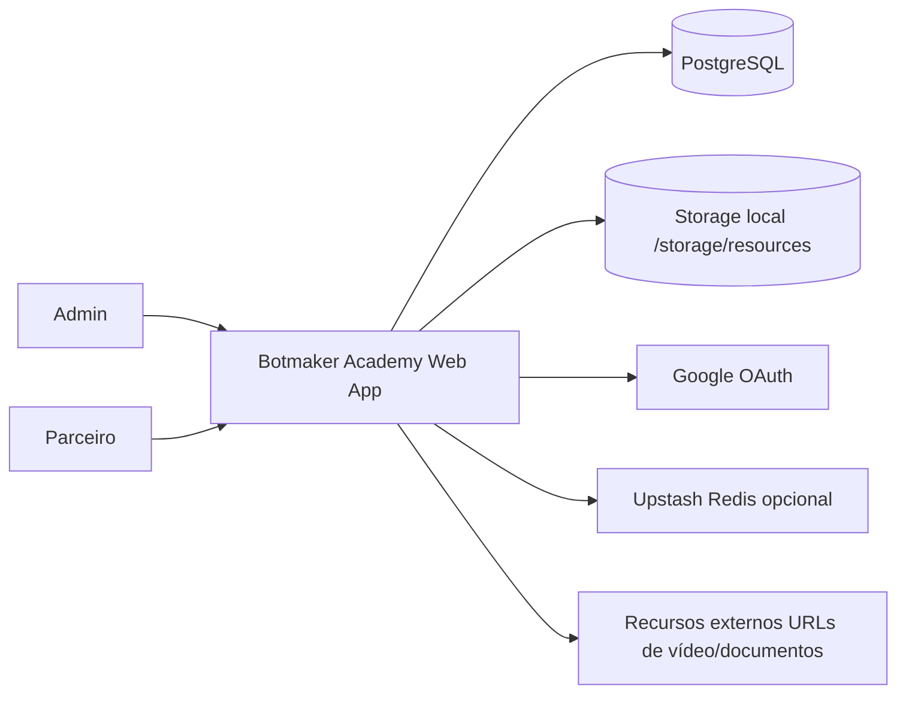
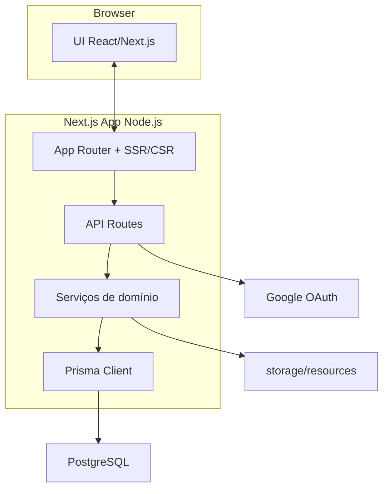
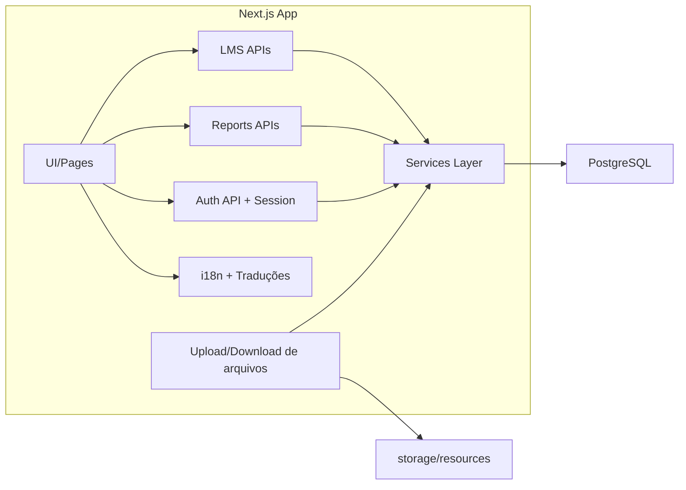
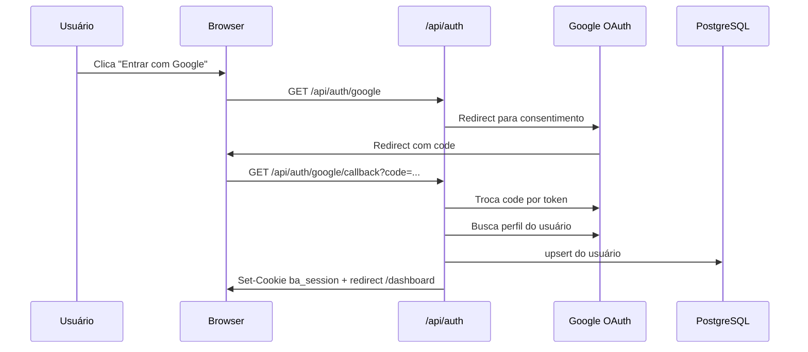
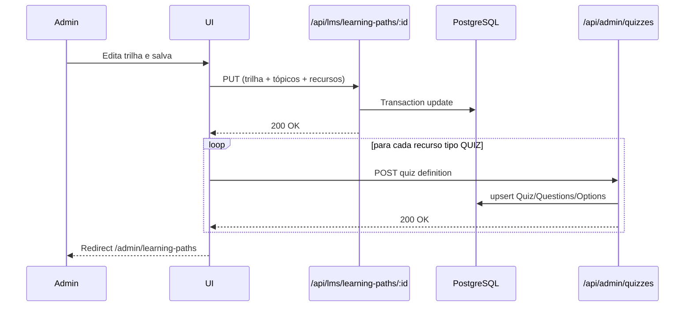
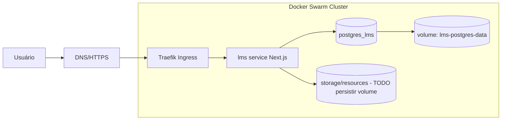

# Diagramas

## Contexto (C4 nível 1)

## Containers (C4 nível 2)

## Componentes (nível lógico)

## Sequência 1: Login com Google

## Sequência 2: Atualizar trilha (Admin)

## Deploy (Docker Swarm + Traefik)

