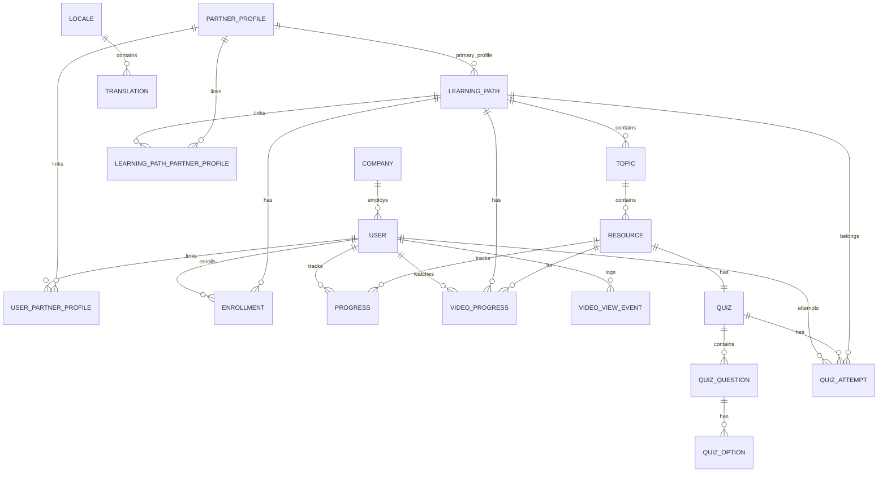

# Dados

## Visão geral do modelo
A aplicação usa PostgreSQL com schema gerenciado pelo Prisma (`prisma/schema.prisma`). As entidades principais cobrem:
- Usuários e perfis de parceria.
- Trilhas (learning paths), tópicos e recursos.
- Progresso de consumo, vídeos e quizzes.
- Traduções dinâmicas por locale.

## ERD (Mermaid)

## Enums
- **Role**: `ADMIN`, `PARTNER`
- **ResourceType**: `VIDEO`, `PDF`, `DOC`, `SLIDE`, `SHEET`, `IMAGE`, `LINK`, `QUIZ`
- **EnrollmentStatus**: `NOT_STARTED`, `IN_PROGRESS`, `COMPLETED`
- **ProgressStatus**: `NOT_VIEWED`, `VIEWED`, `COMPLETED`
- **QuizQuestionType**: `SHORT_TEXT`, `LONG_TEXT`, `MULTIPLE_CHOICE`, `SINGLE_CHOICE`

## Dicionário de dados

### User
| Campo | Tipo | Regras/Constraints |
| --- | --- | --- |
| id | String | PK, `cuid()` |
| firstName | String | obrigatório |
| lastName | String | obrigatório |
| email | String | `@unique` |
| passwordHash | String | obrigatório |
| whatsapp | String? | opcional |
| role | Role | default `PARTNER` |
| preferredLocale | String | default `pt` |
| avatarUrl | String? | opcional |
| emailVerifiedAt | DateTime? | opcional |
| emailVerificationToken | String? | opcional |
| emailVerificationTokenExpiresAt | DateTime? | opcional |
| tokenVersion | Int | default `0` |
| companyId | String? | FK para Company |
| createdAt | DateTime | default `now()` |
| updatedAt | DateTime | `@updatedAt` |

### Locale
| Campo | Tipo | Regras/Constraints |
| --- | --- | --- |
| id | String | PK (ex.: `pt`, `en`, `es`) |
| label | String | obrigatório |
| enabled | Boolean | default `true` |
| createdAt | DateTime | default `now()` |
| updatedAt | DateTime | `@updatedAt` |

### Translation
| Campo | Tipo | Regras/Constraints |
| --- | --- | --- |
| id | String | PK, `cuid()` |
| localeId | String | FK para Locale |
| key | String | único por locale (`@@unique(localeId, key)`) |
| value | String | obrigatório |
| createdAt | DateTime | default `now()` |
| updatedAt | DateTime | `@updatedAt` |

### Company
| Campo | Tipo | Regras/Constraints |
| --- | --- | --- |
| id | String | PK, `cuid()` |
| name | String | `@unique` |
| cnpj | String? | opcional |
| website | String? | opcional |
| logoUrl | String? | opcional |

### PartnerProfile
| Campo | Tipo | Regras/Constraints |
| --- | --- | --- |
| id | String | PK, `cuid()` |
| name | String | `@unique` |
| description | String? | opcional |
| active | Boolean | default `true` |

### UserPartnerProfile
| Campo | Tipo | Regras/Constraints |
| --- | --- | --- |
| id | String | PK, `cuid()` |
| userId | String | FK para User |
| partnerProfileId | String | FK para PartnerProfile |
| (userId, partnerProfileId) | - | único (`@@unique`) |

### LearningPath
| Campo | Tipo | Regras/Constraints |
| --- | --- | --- |
| id | String | PK, `cuid()` |
| title | String | obrigatório |
| description | String? | opcional |
| partnerProfileId | String | FK para PartnerProfile (perfil principal) |
| active | Boolean | default `true` |
| order | Int | default `0` |
| createdAt | DateTime | default `now()` |
| updatedAt | DateTime | `@updatedAt` |

### Topic
| Campo | Tipo | Regras/Constraints |
| --- | --- | --- |
| id | String | PK, `cuid()` |
| learningPathId | String | FK para LearningPath |
| title | String | obrigatório |
| description | String? | opcional |
| order | Int | default `0` |

### LearningPathPartnerProfile
| Campo | Tipo | Regras/Constraints |
| --- | --- | --- |
| id | String | PK, `cuid()` |
| learningPathId | String | FK para LearningPath |
| partnerProfileId | String | FK para PartnerProfile |
| (learningPathId, partnerProfileId) | - | único (`@@unique`) |

### Resource
| Campo | Tipo | Regras/Constraints |
| --- | --- | --- |
| id | String | PK, `cuid()` |
| topicId | String | FK para Topic |
| type | ResourceType | obrigatório |
| title | String | obrigatório |
| description | String | obrigatório |
| url | String | obrigatório (validado por schema) |
| durationMinutes | Int? | opcional |

### Enrollment
| Campo | Tipo | Regras/Constraints |
| --- | --- | --- |
| id | String | PK, `cuid()` |
| userId | String | FK para User |
| learningPathId | String | FK para LearningPath |
| status | EnrollmentStatus | default `NOT_STARTED` |
| startedAt | DateTime? | opcional |
| completedAt | DateTime? | opcional |
| (userId, learningPathId) | - | único (`@@unique`) |

### Progress
| Campo | Tipo | Regras/Constraints |
| --- | --- | --- |
| id | String | PK, `cuid()` |
| userId | String | FK para User |
| resourceId | String | FK para Resource |
| status | ProgressStatus | default `NOT_VIEWED` |
| lastViewedAt | DateTime? | opcional |
| completedAt | DateTime? | opcional |
| (userId, resourceId) | - | único (`@@unique`) |

### VideoViewEvent
| Campo | Tipo | Regras/Constraints |
| --- | --- | --- |
| id | String | PK, `cuid()` |
| userId | String | FK para User |
| trackId | String | obrigatório (sem FK explícita) |
| lessonId | String | obrigatório (sem FK explícita) |
| eventType | String | valores como `play`, `pause`, `progress`, `ended`, `error` |
| position | Int | obrigatório (segundos) |
| duration | Int? | opcional |
| createdAt | DateTime | default `now()` |

### VideoProgress
| Campo | Tipo | Regras/Constraints |
| --- | --- | --- |
| id | String | PK, `cuid()` |
| userId | String | FK para User |
| learningPathId | String | FK para LearningPath |
| resourceId | String | FK para Resource |
| currentTimeSec | Int | default `0` |
| durationSec | Int? | opcional |
| maxPercentViewed | Int | default `0` |
| completed | Boolean | default `false` |
| createdAt | DateTime | default `now()` |
| updatedAt | DateTime | `@updatedAt` |
| (userId, resourceId) | - | único (`@@unique`) |

### Quiz
| Campo | Tipo | Regras/Constraints |
| --- | --- | --- |
| id | String | PK, `cuid()` |
| resourceId | String | `@unique`, FK para Resource (onDelete: Cascade) |
| createdAt | DateTime | default `now()` |
| updatedAt | DateTime | `@updatedAt` |

### QuizQuestion
| Campo | Tipo | Regras/Constraints |
| --- | --- | --- |
| id | String | PK, `cuid()` |
| quizId | String | FK para Quiz (onDelete: Cascade) |
| order | Int | obrigatório |
| prompt | String | obrigatório |
| type | QuizQuestionType | obrigatório |
| correctTextAnswer | String? | opcional |

### QuizOption
| Campo | Tipo | Regras/Constraints |
| --- | --- | --- |
| id | String | PK, `cuid()` |
| questionId | String | FK para QuizQuestion (onDelete: Cascade) |
| order | Int | obrigatório |
| text | String | obrigatório |
| isCorrect | Boolean | default `false` |

### QuizAttempt
| Campo | Tipo | Regras/Constraints |
| --- | --- | --- |
| id | String | PK, `cuid()` |
| userId | String | FK para User (onDelete: Cascade) |
| quizId | String | FK para Quiz (onDelete: Cascade) |
| learningPathId | String | FK para LearningPath (onDelete: Cascade) |
| score | Int | obrigatório |
| percent | Int | obrigatório |
| totalQuestions | Int | obrigatório |
| correctAnswers | Int | obrigatório |
| submittedAt | DateTime | default `now()` |
| final | Boolean | default `true` |
| answers | Json | obrigatório |
| (userId, quizId) | - | único (`@@unique`) |

## Regras de integridade e cascatas
- `Quiz`, `QuizQuestion`, `QuizOption` e `QuizAttempt` usam **onDelete: Cascade** em algumas relações.
- `LearningPath` e seus filhos (topics/resources) são removidos via transações no serviço de domínio.
- Progresso e matrículas são removidos explicitamente em rotinas de delete.

## Migrações
As migrações Prisma estão em `prisma/migrations`:
- `20251211164759_init_db`
- `20251211174738_npx_prisma_migrate_dev_name_add_learningpath_updated_at`
- `20251211192437_add_learningpath_partner_profiles`
- `20251211205348_vidstack`
- `20251212003236_add_video_progress_relations`
- `20251215200814_international`
- `20251226194817_add_email_verified`
- `20251230121000_add_user_avatar`
- `20251230161410_quizz`

## Seed de dados
- Script em `prisma/seed.ts` cria:
  - Admin e usuário parceiro.
  - Perfis de parceria.
  - Trilhas e recursos básicos.
